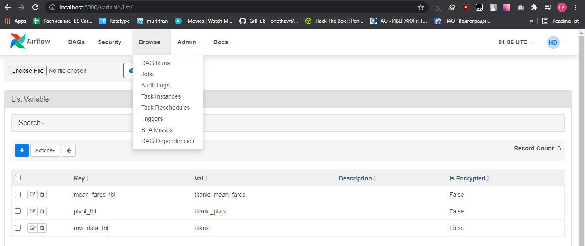
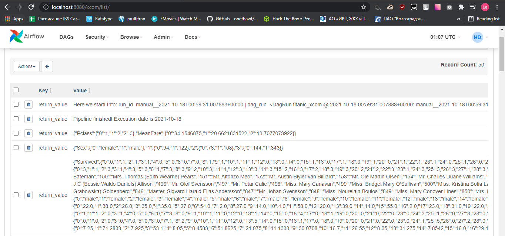
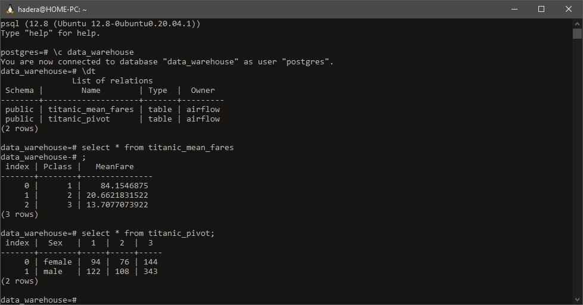

# Дополнительное Практическое задание 2 по теме Airflow 3 урока

1. [Ссылка на исходный код DAG'a](https://github.com/techhadera/dwh-reboot/blob/master/airflow/dags/dag_2.py)  

1. [Ссылка на исходный код utils.py](https://github.com/techhadera/dwh-reboot/blob/master/airflow/dags/utils_2.py) 
1. раздел Variables в UI с названиями таблиц.

  * Скриншот из Variables UI  
    

1. раздел XComs в UI с возвращенным значением исходного датасета.

  * Скриншот из XComs UI  
    

1. выводом консоли с select * обеих таблиц в PostgreSQL (два результата расчета; строк мало, поэтому на экране поместятся оба селекта).

  * Скриншот из консоли psql  
    