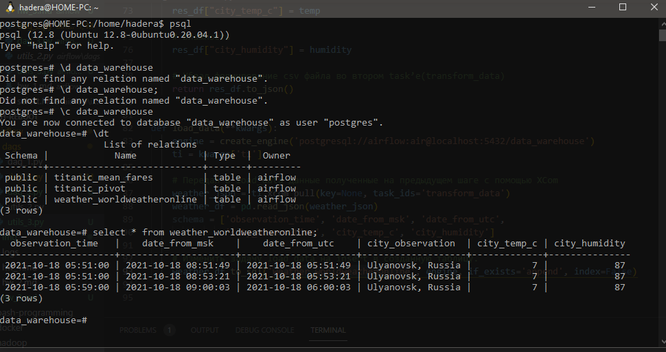

# Практическое задание 3 по теме Airflow

1. [Ссылка на исходный код DAG'a](https://github.com/techhadera/dwh-reboot/blob/master/airflow/dags/dag_3.py)  
   [Ссылка на исходный код utils](https://github.com/techhadera/dwh-reboot/blob/master/airflow/dags/utils_3.py)  
1. Скриншот с отработанным DAG из Airflow.
    *   
1. Скриншот из Postgres с записанными строками в таблице weather_worldweatheronline.  
    *   
    Три записи за час были сделаны из-за того, что я запускал исходный dag с параметром @once 