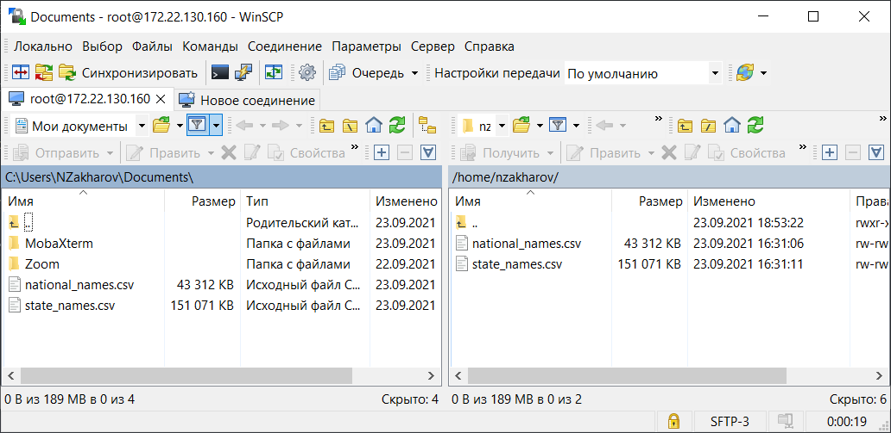

# Практическое задание Hive

1. Скачать любой датасет с сайта Kaggle.com (10 МБ+) (не больше 1ГБ)

    * В качестве датасета используются данные о именах новорожденных в Америке по годам, на национальном уровне и на уровне штатов  
    `https://www.kaggle.com/kaggle/us-baby-names`
    В датасете имеется две таблицы. В таблице state_names.csv статистика по именам по штатам, в national_names.csv по именам на национальном уровне
1. Загрузить этот датасет в HDFS в свою домашнюю папку

    * Для того чтобы загрузить датасеты, нужно перебросить их на datanode по адресу 172.22.130.160. Это можно сделать через WinSCP  
      

1. Создать собственную базу данных в HIVE

    * Создание базы данных  
      ```
      create database znu_on_delete;
      ```

1. Создать таблицы внутри базы данных с использованием всех загруженных файлов. Один файл – одна таблица.

    * Создание таблицы national_names  
      ```
      create external table znu_on_delete.national_names (
        Id string,
        Name string,
        Year_ string,
        Gender string,
        Count_ string
      )
      ROW FORMAT DELIMITED FIELDS TERMINATED BY ','
      STORED AS TEXTFILE
      location "/apps/hive/warehouse/znu_on_delete.db/national_names"
      tblproperties ("skip.header.line.count"="1");
      ```

    * Создание таблицы state_names  
      ```
      create external table znu_on_delete.state_names (
        Id string,
        Name string,
        Year_ string,
        Gender string,
        State string,
        Count_ string
      )
      ROW FORMAT DELIMITED FIELDS TERMINATED BY ','
      STORED AS TEXTFILE
      location "/apps/hive/warehouse/znu_on_delete.db/state_names"
      tblproperties ("skip.header.line.count"="1")
      ```

1. Сделать любой отчет по загруженным данным используя групповые и агрегатные функции.

    * Выполним подсчет количества женских и мужских имен в таблице state_names  
    [Ссылка на файл](https://github.com/techhadera/dwh-reboot/blob/master/hadoop/src/1.sql)  
      ```
      select count(*) total_count, gender
      from znu_on_delete.state_names
      group by gender;
      ```
      Результат:
      [Ссылка на html отчет](https://techhadera.github.io/dwh-reboot/hadoop/urls/count.html)  
      ```
      total_count     gender
      3154009         F
      2493417         M
      Time taken: 9.981 seconds, Fetched: 2 row(s)
      ```

1. Сделать любой отчет по загруженным данным используя JOIN.

    * Выполним join двух таблиц state_names и national_names по атрибутам `(name, year_)`. Выведем информацию об именах и количестве имен новорожденных по годам. Сортируем выборку по году, и выводим последние 10 записей.  
    [Ссылка на файл](https://github.com/techhadera/dwh-reboot/blob/master/hadoop/src/2.sql)  
      ```
      select nn.name, nn.year_, sn.count_
      from znu_on_delete.national_names nn
      join znu_on_delete.state_names sn
      on (sn.name = nn.name and sn.year_ = nn.year_)
      order by nn.year_ desc
      limit 10;
      ```
      Результат:  
      [Ссылка на html отчет](https://techhadera.github.io/dwh-reboot/hadoop/urls/join.html)  
      ```
      nn.name nn.year_        sn.count_
      Aadi    2014            10
      Zyan    2014            5
      Aahil   2014            18
      Aadi    2014            5
      Aadi    2014            9
      Aaliah  2014            6
      Aaliah  2014            6
      Zyan    2014            6
      Aahil   2014            6
      Aahil   2014            10
      Time taken: 24.955 seconds, Fetched: 10 row(s)
      ```