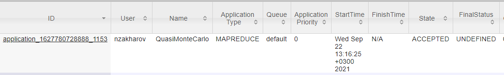

# Практическое задание_ YARN & MR

Опробовать запуски map-reduce задач для кластера используя hadoop-mapreduce-examples.jar. Чтобы увидеть полный список нужно выполнить
/usr/hdp/current/hadoop-mapreduce-client/hadoop-mapreduce-examples.jar
без параметров. (Там, например, wordcount тоже есть)
1. Выполнить любую задачу включенную в этот JAR
    * В качестве примера запустим задачу pi  
    `yarn jar hadoop-mapreduce-examples.jar pi 4 4`
    Вывод:  
      ```
      Number of Maps  = 4
      Samples per Map = 4
      Wrote input for Map #0
      Wrote input for Map #1
      Wrote input for Map #2
      Wrote input for Map #3
      Starting Job
      2021-09-22 13:16:19,506 INFO client.RMProxy: Connecting to ResourceManager at dc1-21-07-06.ibs.org/172.22.130.161:8032
      2021-09-22 13:16:19,628 INFO client.AHSProxy: Connecting to Application History server at dc1-21-07-06.ibs.org/172.22.130.161:10200
      2021-09-22 13:16:19,715 INFO mapreduce.JobResourceUploader: Disabling Erasure Coding for path: /user/nzakharov/.staging/job_1627780728888_1153
      2021-09-22 13:16:19,805 INFO input.FileInputFormat: Total input files to process : 4
      2021-09-22 13:16:19,835 INFO mapreduce.JobSubmitter: number of splits:4
      2021-09-22 13:16:19,945 INFO mapreduce.JobSubmitter: Submitting tokens for job: job_1627780728888_1153
      2021-09-22 13:16:19,946 INFO mapreduce.JobSubmitter: Executing with tokens: []
      2021-09-22 13:16:20,081 INFO conf.Configuration: resource-types.xml not found
      2021-09-22 13:16:20,082 INFO resource.ResourceUtils: Unable to find 'resource-types.xml'.
      2021-09-22 13:16:20,139 INFO impl.YarnClientImpl: Submitted application application_1627780728888_1153
      2021-09-22 13:16:20,169 INFO mapreduce.Job: The url to track the job: http://dc1-21-07-06.ibs.org:8088/proxy/application_1627780728888_1153/
      2021-09-22 13:16:20,170 INFO mapreduce.Job: Running job: job_1627780728888_1153
      ```
    * Состояние таска можно отследить при помощи команды  
    `yarn application -status application_1627780728888_1153`
1. Найти свою задачи в интерфейсе YARN RM

    * Во вкладке 
    `http://172.22.130.160:8089/cluster/apps/ACCEPTED`
    Можно увидеть список задач в очереди, среди которых есть и моя задача
    