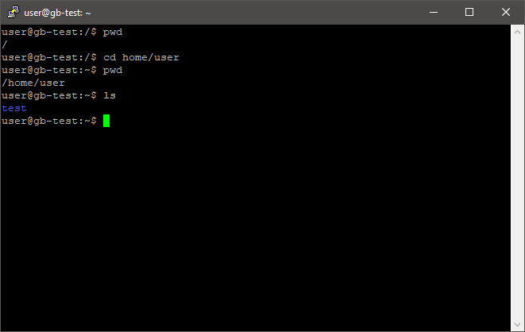
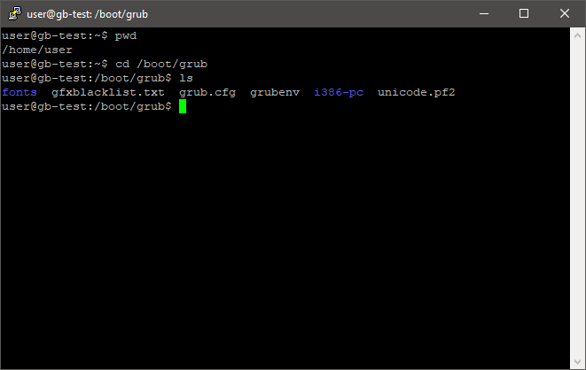
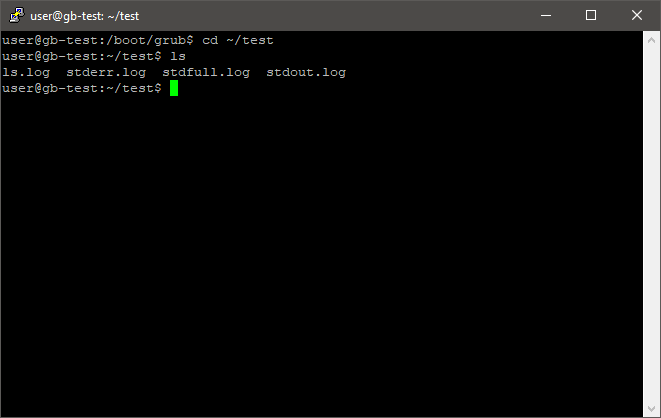

# Практическое задание по теме Навыки работы в командной строке Linux.

1. Навигация по файловой системе. Попрактиковаться в перемещении между каталогами, используя полный и относительный путь. Перечислить, какие параметры команды cd позволят быстро вернуться в домашний каталог, позволят перейти на уровень выше.
 
    * Переход, используя относительный путь
    
    
    * Переход, используя абсолютный путь
    
    
    * Переход через домашний каталог
    
    
    * Для быстрого перехода в домашний каталог, можно использовать: `cd ~`
    
    * Для быстрого перехода на уровень выше, можно использовать: `cd ..`

1. Управление файлами и каталогами и текстовые редакторы. Создать файл с наполнением, используя несколько способов. Использовать разобранные текстовые редакторы для наполнения файлов данными. Создать копии созданных файлов, создать несколько каталогов с подкаталогами, перенести несколько файлов в созданные каталоги. Перечислить команды и используемые параметры команд.

	* Создание и заполнение файла через `echo`
	
    
	* Наполнение файла при помощи Vim
	
    
    * Наполнение файла при помощи nano
	
    
    * Создание копий созданных текстовых файлов
    
    
    * Создание нескольких каталогов с подкаталогами
    
    
    * Перенос файлов в созданные каталоги
    
    
    * Команды, и используемые параметры  
    Копирование `cp`  
    Перенос `mv`  
    Создание каталогов `mkdir`

1. Используя дополнительный материал, настроить авторизацию по SSH с использованием ключей.
