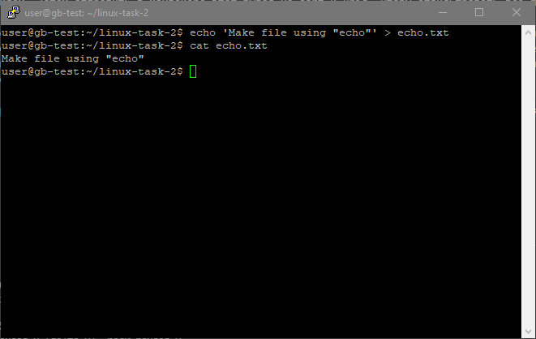
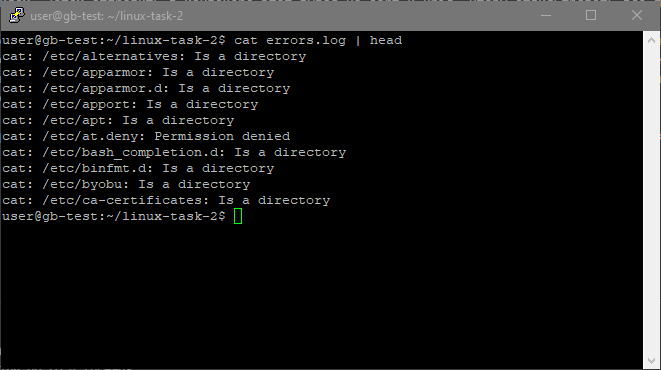
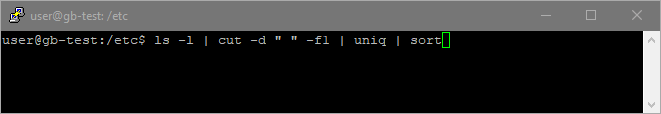
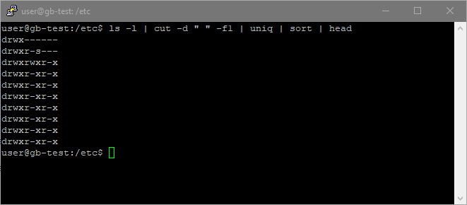
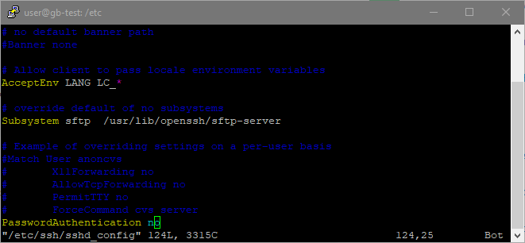
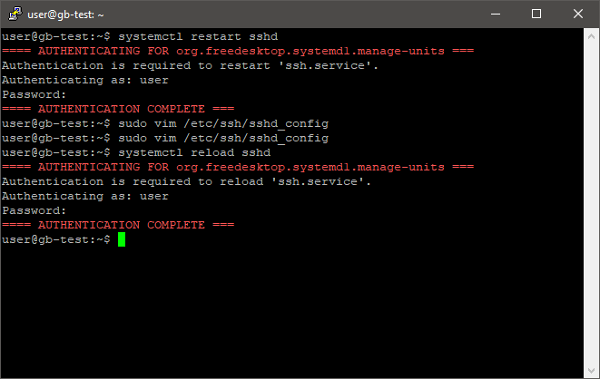
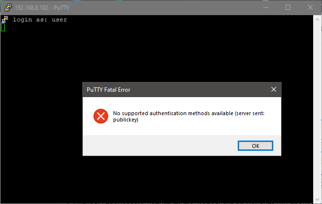
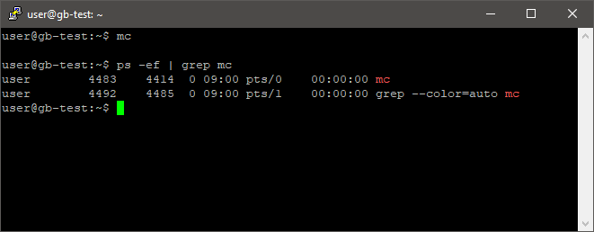
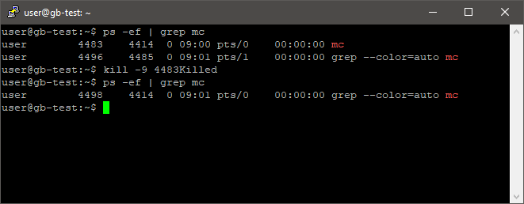

# Практическое задание по теме Навыки управления процессами в Linux.

1. Потоки ввода/вывода. Создать файл, используя команду echo. Используя команду cat, прочитать содержимое каталога etc, ошибки перенаправить в отдельный файл.

    * Создание файла, используя команду echo  
    

    * Используя команду cat, читаем содержимое каталога etc, ошибки перенаправленны в errors.txt  
      
    

1. Конвейер (pipeline). Использовать команду cut на вывод длинного списка каталога, чтобы отобразить только права доступа к файлам. Затем отправить в конвейере этот вывод на sort и uniq, чтобы отфильтровать все повторяющиеся строки.

    * Используя команду cut(с парметром -d " " для разделения подстрок в строке, и -f1 для выбора первого слова с строке), на вывод списка каталога (ls с параметром -l). Далее используем фильтр uniq и сортировку sort  
      
    

1. Управление процессами. Изменить конфигурационный файл службы SSH: /etc/ssh/sshd_config, отключив аутентификацию по паролю PasswordAuthentication no. Выполните рестарт службы systemctl restart sshd (service sshd restart), верните аутентификацию по паролю, выполните reload службы systemctl reload sshd (service sshd reload). В чём различие между действиями restart и reload?

    * Отключаем аутентификацию по паролю  
    

    * Выполняем рестарт службы sshd, возвращаем аутентификацию по паролю, выполняем релоад sshd (проблем с входом по паролю не возникает)  
    

    * Но если попытаться подключиться по ssh по паролю, когда такой способ отключен, возникнет ошибка  
    

    * Различие между restart и reload заключается в том, что запуск reload позволяет обновить конфигурационные данные без остановки самой службы.

1. Сигналы процессам. Запустите mc. Используя ps, найдите PID процесса, завершите процесс, передав ему сигнал 9.

    * Запуск mc и поиск его PID  
    

    * Убийство процесса mc  
    