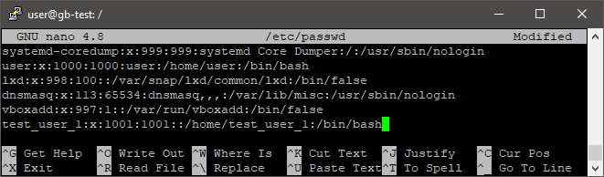

# Практическое задание по теме Управление пользователями и группами пользователей.

1. Управление пользователями: a. создать пользователя, используя утилиту useradd; b. удалить пользователя, используя утилиту userdel; c. создать пользователя в ручном режиме.

    * Создание пользователя при помощи useradd  
    

    * Удаление пользователя при помощи userdel  
    

    * Создание пользователя при помощи adduser  
      
    

1. Управление группами: a. создать группу с использованием утилит и в ручном режиме; b. попрактиковаться в смене групп у пользователей; c. добавить пользователя в группу, не меняя основной; d. удалить пользователя из группы.

    * Создание группы с использованием addgroup  
    

    * Создание группы с использованием groupadd  
    

    * Добавление пользователя test_user_2 в группу test_group_1, а после в test_group_2  
    

    * Удаление пользователя test_user_2 из группы test_group_1  
    

1. Добавить пользователя, имеющего право выполнять команды/действия от имени суперпользователя. Сделать так, чтобы sudo не требовал пароль для выполнения команд.

    * Добавление пользователя с правами sudo  
    

    * Сброс требования пароля на выполнение команд  
    
