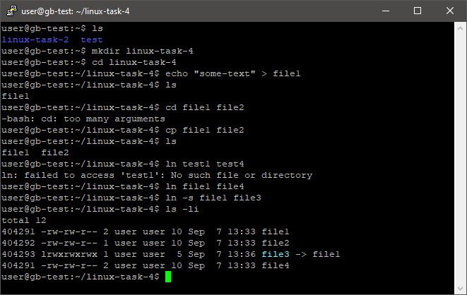
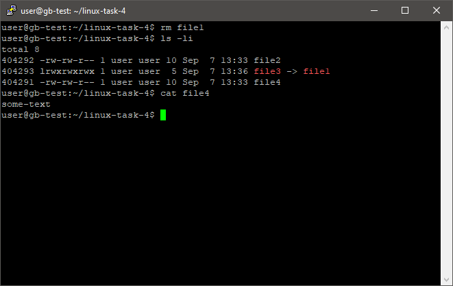
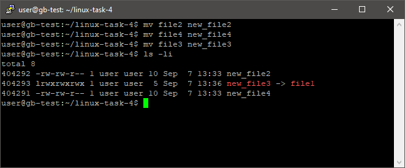
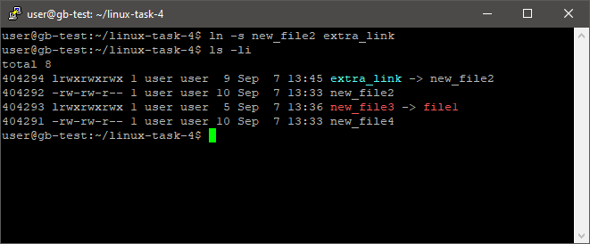
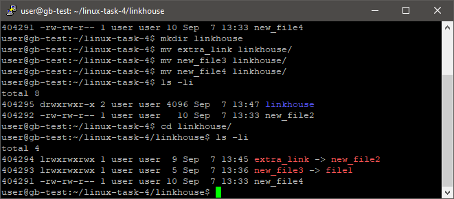

# Практическое задание по теме Управление правами на файлы и каталоги

1. Создать файл file1 и наполнить его произвольным содержимым. Скопировать его в file2. Создать символическую ссылку file3 на file1. Создать жёсткую ссылку file4 на file1. Посмотреть, какие inode у файлов. Удалить file1. Что стало с остальными созданными файлами? Попробовать вывести их на экран.

    * Создание жесткой и символической ссылки на файл file1  
    

    * Удаление file1. В данном случае перестанет работать символическая ссылка file3. Данные также можно получить по жесткой ссылке  
    

1. Дать созданным файлам другие, произвольные имена. Создать новую символическую ссылку. Переместить ссылки в другую директорию.

    * Переименование файлов  
    

    * Создание новой символической ссылки extra_link на файл new_file2  
    

    * Перемещение всех ссылок в папку linkhouse. Ссылка extra_link перестала работать  
    

1. Создать два произвольных файла. Первому присвоить права на чтение и запись для владельца и группы, только на чтение — для всех. Второму присвоить права на чтение и запись только для владельца. Сделать это в численном и символьном виде.

    * Создание файлов file1 и file2. Присвоение файлу file1 права на чтение и запись для владельца и группы, а на чтение для всех. (символный вид)  
      
    В численном виде будет:  
    `chmod 774 file1 `

    * Выставление прав на file2  
    В численном: `chmod 744 file2`  
    В символьном: `chmod -R u=rw-, g=r--, o=r-- file2`

1. Создать группу developer и нескольких пользователей, входящих в неё. Создать директорию для совместной работы. Сделать так, чтобы созданные одними пользователями файлы могли изменять другие пользователи этой группы.

    * Создание группы developer  
    `sudo addgroup developer`

    * Создание пользователей и добавление их в группу developer  
    `sudo adduser dev_1 --gid 1004`  
    `sudo usermod -aG developer dev_1`  
    `sudo adduser dev_2 --gid 1004`  
    `sudo usermod -aG developer dev_2`

    * Для того, чтобы все созданные файлы пользователями dev_1 и dev_2 имели доступ rw- для группы developer, необходимо каждый раз при входе прописывать `umask 002`. Таким образом, доступ вычисляется как `-rw-rw-r--` (один из способов)

    * Cоздаем общую папку dev_project и файл project внутри   
    `sudo su dev_1`
    `sudo mkdir dev_project`  
    Добавляем права rwx для группы  
    `sudo chmod -R 771 dev_project`

    * Меняем группу каталога и его содержимого  
    `sudo chgrp -R developer dev_project`  
    Добавляем SGID, для того чтобы все подкатегории и файлы наследовали права папки dev_project  
    `sudo chmod +s dev_project`  
    Вывод команды `ls -hla`  
    `drwsrws--x  2 root  developer 4.0K Sep 11 01:06 dev_project`  

    * Проверка возможности создания файлов в общей папке группы developer юзером dev_1  
        ```
        dev_1@gb-test:/home/dev_project$ nano devs_notes
        dev_1@gb-test:/home/dev_project$ cat devs_notes
        note by dev_1
        dev_1@gb-test:/home/dev_project$ pwd
        /home/dev_project
        dev_1@gb-test:/home/dev_project$
        ```
    * Провeрка возможности редактирования файла юзером dev_2, созданного юзером dev_1
        ```
        user@gb-test:/home/dev_project$ sudo su dev_2
        dev_2@gb-test:/home/dev_project$ ls -hla
        total 12K
        drwxrws--x 2 root  developer 4.0K Sep 11 02:02 .
        drwxr-xr-x 6 root  root      4.0K Sep 11 01:36 ..
        -rw-rw-r-- 1 dev_1 developer   14 Sep 11 02:02 devs_notes
        dev_2@gb-test:/home/dev_project$ echo 'note by dev2' >> devs_notes
        dev_2@gb-test:/home/dev_project$ cat devs_notes
        note by dev_1
        note by dev2
        ```
